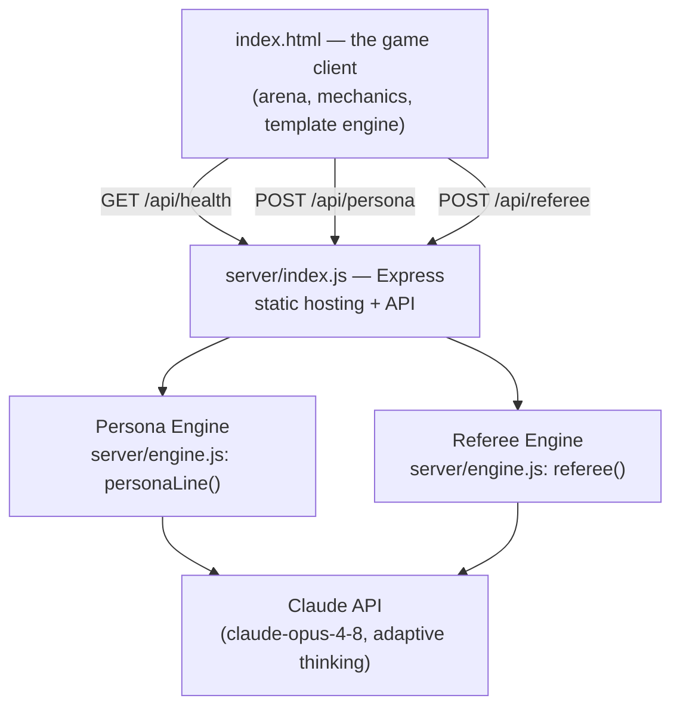

# Verbal Kombat — Architecture

Phase 1 of [VISION.md](VISION.md): **the Referee**. The game gains a thin server
that turns the toy into a program — live AI-generated arguments, and an AI referee
that judges what *you* type. Everything degrades gracefully to the self-contained
offline game.

## Components



| Component | Responsibility |
|---|---|
| **Client** (`index.html`) | All game mechanics: rounds, damage, meters, animations, transcript. Deterministic — the server never decides who wins a roll, only supplies language and judgment. |
| **Match mechanics** | Stay client-side and random-roll based for CPU moves (fast, dependable, balance-tunable). Live mode replaces the *content*, not the dice. |
| **Persona Engine** (`POST /api/persona`) | One fresh, in-character argument line per call, matching a requested move type — including deliberately committing a named fallacy when the game has rolled a whiff. |
| **Referee Engine** (`POST /api/referee`) | Judges one argument's *form*: `evidence` / `logic` / `zinger` / `fallacy` (+ name), `quality` 0–100, and a one-line `receipt`. Structured outputs (`output_config.format` with a JSON schema) guarantee a parseable verdict. |
| **Safety layer** (`server/prompts.js`) | Lives in the prompts and response handling: the referee scores form, never political conclusions; personas are explicit parody with a no-fabrication rule for living people; hateful topics come back `DISQUALIFIED`; API `refusal` stop reasons map to HTTP 422. |

## Mode matrix

| How you run it | CPU argument lines | Your typed arguments | Move buttons |
|---|---|---|---|
| `file://index.html` (double-click) | Template engine | — (input hidden) | Template engine |
| `npm run dev`, no credentials | Template engine | — (input hidden) | Template engine |
| `npm run dev` + `ANTHROPIC_API_KEY` | **Claude, in character** | **Judged by the AI referee** | Claude lines, house dice |

The client decides once at load: `GET /api/health` → `{live: true}` shows the
"● LIVE AI REFEREE" badge and the free-argument input. Every live call has a
timeout and falls back to the template engine, so a network hiccup can never
stall a match.

## A live turn, end to end

1. **CPU turn** — client rolls the move and the fallacy check exactly as offline,
   then asks `/api/persona` for a line matching the rolled outcome ("commit a
   STRAWMAN about pineapple pizza, as Gordon Ramsay"). Damage comes from the
   house dice; Claude supplies the words.
2. **Player typed turn** — the player writes their own argument and submits.
   `/api/referee` classifies it and scores quality. Evidence/logic/zinger →
   damage scaled by quality (90+ is a critical); fallacy → BLOCKED, credibility
   damage, and the named fallacy on the big board. The referee's receipt is
   shown either way — the referee always shows its work.

## API contracts

`POST /api/referee`

```jsonc
// request
{ "argument": "...", "topic": "...", "speaker": "...", "stance": "...",
  "opponent": "...", "opponentStance": "..." }
// response 200
{ "classification": "evidence|logic|zinger|fallacy",
  "fallacy_name": "STRAWMAN" /* or "" */, "quality": 0-100, "receipt": "..." }
// 422 topic disqualified · 503 no credentials/rate limited · 400 bad input
```

`POST /api/persona`

```jsonc
// request
{ "fighter": {"name","tag","stance"}, "opponent": {"name","stance"},
  "topic": "...", "move": "jab|hook|zing", "fallacy": "STRAWMAN"|null,
  "recent": ["last few lines"] }
// response 200
{ "line": "..." }
```

## Model settings

- Model: `claude-opus-4-8` (override with `VK_MODEL`).
- `thinking: {type: "adaptive"}`, `effort: "medium"` — verdicts are
  latency-sensitive (one per combat exchange); raise to `high` if judging
  quality matters more than pace.
- Credentials resolve from the environment (`ANTHROPIC_API_KEY`,
  `ANTHROPIC_AUTH_TOKEN`, or an `ant auth login` profile).

## Design invariants (from VISION.md)

1. **The referee is sacred** — it never sees which side the player is on when
   scoring form, and every verdict carries a receipt.
2. **Comedy is the physics engine** — personas are written parody; the persona
   prompt forbids invented factual claims about living people.
3. **The audience is a player** — verdicts and receipts land in the transcript,
   which remains the shareable artifact.
4. **Skill = rhetoric** — the typed-argument path is the game: argue better,
   hit harder.

## What Phase 1 deliberately defers

- Referee-driven CPU outcomes (dice still decide hits for pacing/balance).
- Streaming verdicts, multiplayer rooms, audience voting (Phase 2).
- Persistent ratings / Logic League (Phase 3).
