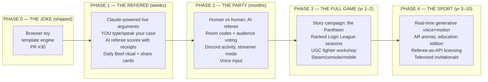
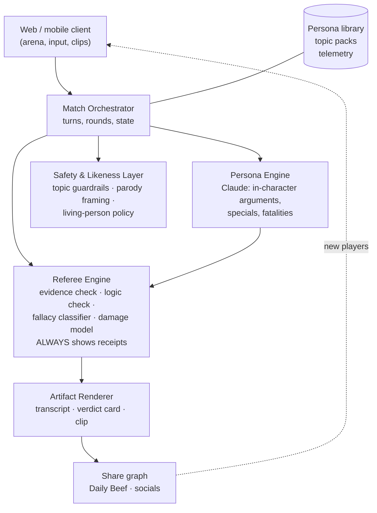

# VERBAL KOMBAT — The BIG Plan

> *Settle it in the arena of ideas.*
> A meditation on what this game actually is, what history and biology say about it,
> what the genre's hits teach us, and a phased plan from browser toy to a new sport.

---

## Part I — The Meditation

### What we actually built

The "exit, pursued by a bear" laugh is the tell. The fun unit of Verbal Kombat is
**a specific persona colliding with absurd stakes, adjudicated with total seriousness**.
Kanye vs. Zuckerberg on LA restaurants works because the *frame* (fatalities, health
bars, an official transcript "binding until the rematch") treats a petty argument with
championship gravity. That inversion is the comedy engine. Everything in the plan must
protect it.

### The historical perspective: this game is 1,000+ years old

We did not invent this; we digitized it.

- **Flyting** (Norse & Scots, ~5th–16th c.): ritual insult combat in verse, performed
  before an audience, with winners and reputations at stake. Literally the ancestor of
  both rap battles and Monkey Island's insult sword-fighting.
- **The Dozens → battle rap**: competitive verbal one-upmanship as spectator sport,
  scored by crowd reaction — our "audience as player" mechanic, centuries old.
- **Scholastic disputation** (medieval universities): the *quodlibet* was public
  intellectual bloodsport — a master defended any question against all comers. Three
  rounds, formal moves, a verdict. We rebuilt this with health bars.
- **Lincoln–Douglas debates (1858)**: seven three-hour debates drew crowds of 15,000
  as *mass entertainment*. Debate-as-spectacle is proven at stadium scale.
- **The Oxford Union, presidential debates, court TV**: humans reliably watch
  structured verbal combat, and they crave a *verdict*.

**Lesson:** Verbal Kombat is a revival, not a novelty. Revivals of deep human rituals
(Wordle = newspaper puzzle, battle royale = playground king-of-the-hill) have long
lives. Novelties die; rituals return.

### The biological perspective: other species already play this game

Across the animal kingdom, most conflict is resolved by **ritualized display, not
injury** — honest signals substitute for violence:

- Red deer stags settle most contests by **roaring duels** — escalation to antlers only
  when the roar-off is close.
- Songbirds fight territorial wars through **counter-singing**; matching a rival's song
  type is an escalating "argument."
- Mantis shrimp spar with armored telsons in **ritual exchanges** that rarely maim.
- Cuttlefish males run dazzling pattern displays; the better show usually wins the mate.

**Lesson:** display-based conflict resolution is evolutionarily ancient because it is
*cheap and stable*. Verbal Kombat's thesis — **settle it with display, spare the
bloodshed** — is not just a joke; it's the oldest conflict technology there is. The
fatality is the roar that means nobody has to use the antlers. This is also the moral
license for the violence aesthetic: the only thing that dies is a bad argument.

### The civic perspective (quietly, the important one)

The referee rewards *form* — evidence, sound inference — and punishes *named
fallacies*, regardless of which side you're on. A generation that plays this game
learns to spot a strawman the way gamers learn frame data. **It's media literacy
disguised as a fatality.** This is the difference between "funny toy" and "thing
schools license." We never claim truth-authority on contested values; the referee
scores argument quality, not political conclusions.

---

## Part II — What the genre's history teaches

| Game | What it proved | What it was punished for | Our rule |
|---|---|---|---|
| Mortal Kombat ('92) | Personality + transgression + a signature shareable moment ("FINISH HIM") beats mechanical purity for mass reach | Spectacle over depth wears thin | The fatality is the original viral clip — every match must end in a clippable moment |
| Street Fighter II | Depth via matchup knowledge | Execution barrier excluded casuals | Our "execution" is *rhetoric* — depth comes from ideas, not dexterity. Grandma can body you if she argues better |
| Super Smash Bros. | The crossover roster IS the content; couch-social carried it for decades | Weak online netcode | "Who would win, Socrates or Gordon Ramsay" is our Smash fantasy; live/multiplayer infra must be first-class, not bolted on |
| MK11 / NetherRealm era | Cinematic story mode reinvented fighting-game single-player | Grindy unlock economies — massive backlash | Never paywall fighters or wins. Monetize style, story, and occasions |
| Ace Attorney | Argument-as-drama sustains a 20-year franchise; "OBJECTION!" is a brand | Linear, hand-authored | Evidence + contradiction-spotting are mechanics; LLMs remove the linearity ceiling |
| Monkey Island insult sword-fighting | Combat-as-dialogue is beloved 30+ years later | Static insult database | We are infinite insult sword-fighting. This is the clearest ancestor of the whole design |
| Jackbox / Quiplash | Room-code party play; the audience votes; streams itself | Shallow solo experience | Spectators get verbs (vote, judge, heckle). Design every mode to be watchable |
| HQ Trivia | Live mass events are electric | Cost + novelty collapse | Prefer rituals over events: a daily beef, not a nightly show |
| Wordle | A daily ritual + a spoiler-free share artifact = organic growth machine | — | The transcript/fatality card is our share grid |
| AI Dungeon | Infinite generation hooks players | Coherence drift + moderation crisis | The referee's rules ARE the game; safety layer is core architecture, not a patch |
| Infinite Craft | Generative surprise + collectible discoveries go viral | Shallow retention | Fatality lines, matchups, and verdicts become collectible/discoverable content |
| character.ai | Persona chat retains at scale | Real-person likeness concerns | Personas are *written parody*, clearly framed; living-person likeness policy from day one (post-AB 1836 world) |

## Part III — Games in 2036, and where we sit

Ten-year bets we're placing:

1. **Every NPC becomes generative** — cheap, fast, local models doing real-time
   dialogue, voice, and animation. Hand-written content stops being the bottleneck;
   *curation, fairness, and brand trust* become the scarce goods. Our referee is
   exactly that scarce good.
2. **The link becomes the game.** Instant play (web, Discord activities, whatever
   succeeds them) beats installs. We were born there.
3. **Games become shows.** The spectator layer (chat voting, clip economies,
   streamer-native modes) is a first-class platform. Debate is *already* a show.
4. **Voice-first play goes mainstream** — arguing out loud at a screen is a natural
   interface in a way pressing X never was.
5. **AI-refereed social sports emerge as a genre** — humans supply intent and comedy,
   AI adjudicates fairly and theatrically. Somebody will own "argument sport" the way
   Riot owns MOBA. That's the BIG BIG BIG: **Verbal Kombat is not a fighting game; it
   is the first franchise of a new sport.**

## Part IV — Design pillars (the constitution)

1. **The Referee is sacred.** Fair, legible, shows receipts. Scores form, not tribe.
   If players stop trusting the referee, there is no game.
2. **Comedy is the physics engine.** Every system must be able to produce a laugh.
   Personas are written craft, not scraped mimicry.
3. **The audience is a player.** Every match emits an artifact (clip, transcript,
   verdict card). Spectators always have verbs.
4. **Skill = rhetoric.** Getting better at the game means actually getting better at
   arguing. Progression is secretly a curriculum.

## Part V — The Plan

### Phase 1 — "The Referee Update" *(the decisive move — build next)*

The pivotal shift: **from watching AI argue to arguing yourself.** You pick your
fighter-avatar and your take; the AI persona argues back *for real* (Claude API,
genuinely fresh lines); the **Referee Engine** scores each of your arguments —
evidence lands, logic chains combo, named fallacies get BLOCKED with a one-line
explanation of why. Suddenly the health bar measures *you*.

- Daily Beef: one spicy topic per day, same for everyone; share card shows your
  verdict + best line, Wordle-style.
- Ship: web + mobile web. Metrics: D1 retention, matches/session, share-card rate.
- This is buildable **now** in the local Claude Code session with an Anthropic API key.

### Phase 2 — "The Party Update"

Two humans argue; the AI referees; the room votes. Jackbox-style codes, Discord
activity, streamer mode where chat is the crowd meter. Voice input ("OBJECTION!"
shouted at your phone). Metrics: multiplayer session share, clips exported.

### Phase 3 — "The Full Game"

- **Story mode:** climb the Pantheon of history's greatest arguers; each boss embodies
  a fallacy you must learn to counter; final boss is your own worst habit.
- **Logic League:** ranked seasons; your rating is literally your demonstrated rhetoric.
- **UGC workshop:** player-authored fighters and topic packs behind a moderation +
  likeness-policy gate.
- Monetization (post-MK11 rules): cosmetics, arenas, announcer packs, story chapters,
  education licenses. Never pay-for-fighters, never pay-to-win.

### Phase 4 — "The Sport"

Real-time generated voice and animation (the 2036 stack), AR living-room arenas,
school curriculum edition (fallacy literacy), the Referee licensed as an API, and
sponsored celebrity charity debates settled *in canon*. The endgame: when two people
disagree at dinner, "settle it in Verbal Kombat" is a thing humans say.

## Part VI — Architecture (Phase 1 target)

## Part VII — Risks

| Risk | Mitigation |
|---|---|
| LLM cost per match | Cache persona openers; small model for classification, big model for zingers; template fallback (v1!) as offline mode |
| Real-person likeness law (digital-replica statutes) | Written parody, clearly labeled; no voice cloning of real people; likeness policy + takedown path in UGC |
| Toxic topics / referee weaponized in real disputes | Topic guardrails; referee scores form not conclusions; comedy framing is a load-bearing safety feature |
| "The AI judge is biased" discourse | Receipts on every call; publish the rubric; let players appeal (and make the appeal funny) |
| Novelty fade | Ritual (Daily Beef), roster growth, UGC — the Wordle/Smash retention playbook |

## Part VIII — The Decision

**We build Phase 1: the Referee.** Everything BIG in this plan — the party mode, the
league, the sport — sits on one foundation: an AI referee that players trust and love
being judged by. It is also the single feature that converts the toy into a game (you
argue, you get scored, you improve). And it is buildable this week with the Claude API.

*This ruling is binding until the rematch.*
